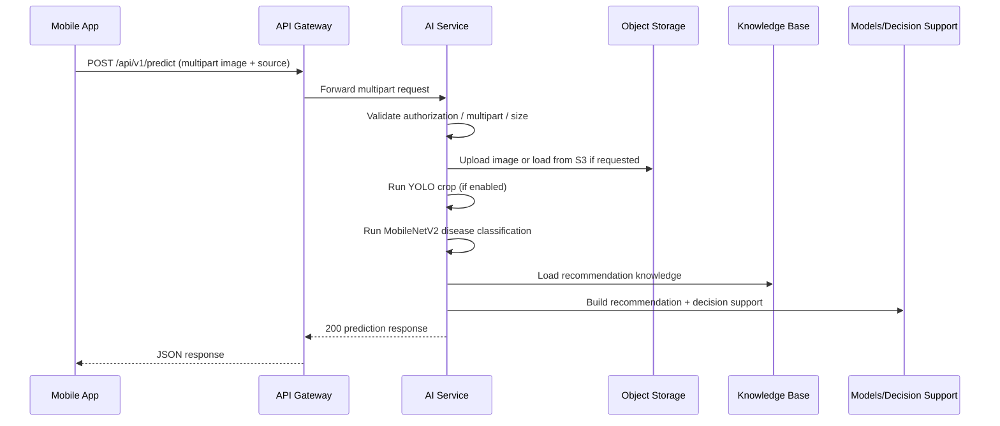

# Mobile Backend Final Audit

## 1. Scope and verification basis

This audit was produced from the live backend source in the current repository.

Verified sources:

- Spring Boot controllers, DTOs, enums, and exception handlers
- FastAPI routers, schemas, and OpenAPI models
- Controller and service tests already present in the repository
- Additional compile/test runs executed during this audit

Rules followed:

- No endpoint contract was changed
- No business logic was changed
- No new backend feature was introduced

---

## 2. Final status summary

| Item | Status |
|---|---|
| Public REST endpoints documented | Yes |
| Swagger/OpenAPI added to missing Spring controllers | Yes |
| Swagger/OpenAPI preserved on Auth | Yes |
| FastAPI OpenAPI available | Yes |
| Postman readiness | Yes |
| Runtime verification completed for some APIs | Yes |
| Runtime verification completed for every endpoint | No |

---

## 3. API inventory

### 3.1 Authentication and profile

| Method | Route | Purpose | Runtime verified |
|---|---|---|---|
| POST | `/api/auth/register` | Register farmer or legacy expert | Not run |
| POST | `/api/auth/register/engineer` | Engineer registration with qualification files | Not run |
| POST | `/api/auth/otp/resend` | Resend registration OTP | Not run |
| POST | `/api/auth/otp/verify` | Verify registration OTP | Not run |
| POST | `/api/auth/login` | Login and return JWT bundle | Not run |
| POST | `/api/auth/logout` | Revoke current token | Not run |
| POST | `/api/auth/refresh` | Refresh access token | Not run |
| GET | `/api/auth/admin/engineer-applications` | List engineer applications | Not run |
| GET | `/api/auth/admin/engineer-applications/{applicationId}` | Engineer application details | Not run |
| POST | `/api/auth/admin/engineer-applications/{applicationId}/approve` | Approve engineer application | Not run |
| POST | `/api/auth/admin/engineer-applications/{applicationId}/reject` | Reject engineer application | Not run |
| GET | `/api/users/me` | Get authenticated profile | Yes |
| PUT | `/api/users/me` | Update authenticated profile | Yes |
| POST | `/api/users/me/avatar` | Upload avatar | Yes |
| DELETE | `/api/users/me/avatar` | Delete avatar | Yes |

### 3.2 Search

| Method | Route | Purpose | Runtime verified |
|---|---|---|---|
| GET | `/api/search` | Keyword search with type filter, paging, sorting | Yes |
| POST | `/api/search/internal/index` | Internal search indexing | Not run |

### 3.3 Notification

| Method | Route | Purpose | Runtime verified |
|---|---|---|---|
| POST | `/api/v1/notification/otp/generate` | Generate OTP | Not run |
| POST | `/api/v1/notification/otp/validate` | Validate OTP | Not run |
| GET | `/api/v1/notification/notifications` | List inbox notifications | Yes |
| GET | `/api/v1/notification/notifications/unread` | List unread notifications | Yes |
| PATCH | `/api/v1/notification/notifications/{id}/read` | Mark one notification read | Yes |
| PATCH | `/api/v1/notification/notifications/read-all` | Mark all notifications read | Yes |
| DELETE | `/api/v1/notification/notifications/{id}` | Delete a notification | Yes |
| GET | `/api/v1/notification/notifications/count` | Count unread notifications | Yes |
| GET | `/api/v1/notification/history` | Get notification/email history by recipient | Not run |

### 3.4 Cultivation

| Method | Route | Purpose | Runtime verified |
|---|---|---|---|
| GET | `/api/cultivation-schedules` | List cultivation schedules | Not run |
| GET | `/api/cultivation-schedules/{id}` | Get cultivation schedule | Not run |
| POST | `/api/cultivation-schedules` | Create cultivation schedule | Not run |
| PATCH | `/api/cultivation-schedules/{id}/status` | Update schedule status | Not run |
| DELETE | `/api/cultivation-schedules/{id}` | Delete cultivation schedule | Not run |

### 3.5 AI prediction, RAG, and admin RAG

| Method | Route | Purpose | Runtime verified |
|---|---|---|---|
| POST | `/api/v1/predict` | Multipart image prediction | Not run |
| POST | `/api/v1/predict/from-s3` | Prediction from S3 object key | Not run |
| POST | `/api/ai/diagnoses` | Deprecated prediction route | Not run |
| POST | `/api/v1/chat/ask` | RAG consultation | Not run |
| GET | `/api/v1/rag/status` | RAG status | Not run |
| POST | `/api/v1/rag/reindex` | RAG reindex | Not run |
| POST | `/api/v1/rag/rebuild` | RAG rebuild | Not run |
| GET | `/api/v1/rag/documents` | RAG documents list | Not run |
| DELETE | `/api/v1/rag/document/{document_id}` | Delete RAG document | Not run |
| GET | `/api/v1/rag/statistics` | RAG statistics | Not run |
| GET | `/admin/rag/status` | Admin RAG status | Not run |
| POST | `/admin/rag/reindex` | Admin RAG reindex | Not run |
| POST | `/admin/rag/reload` | Admin RAG reload | Not run |
| GET | `/admin/rag/documents` | Admin RAG documents | Not run |
| DELETE | `/admin/rag/cache` | Clear RAG cache | Not run |
| GET | `/admin/rag/statistics` | Admin RAG statistics | Not run |

### 3.6 Chat

| Method | Route | Purpose | Runtime verified |
|---|---|---|---|
| WS | `/chat` namespace via Socket.IO | Realtime messaging | Not run |

### 3.7 Traceability

| Method | Route | Purpose | Runtime verified |
|---|---|---|---|
| None found | N/A | No public REST controller exposed in current source | N/A |

---

## 4. Request, success, and error examples

The following examples are source-validated from the current DTOs, controller tests, and schemas.

### 4.1 Authentication

#### Register farmer

Request:

```json
{
  "email": "farmer@example.com",
  "password": "StrongPassword123!",
  "fullName": "Nguyen Van A",
  "phoneNumber": "0901234567",
  "role": "FARMER"
}
```

Success:

```json
{
  "message": "Registration accepted. Check your email for the OTP."
}
```

Common errors:

- `400` validation error if email/password/fullName are invalid
- `409` if email already exists
- `401` if token is required for an admin-only endpoint

#### Register engineer

Request:

```json
multipart/form-data
email=engineer@example.com
password=StrongPassword123!
fullName=Nguyen Thi B
phoneNumber=0901234567
workplace=Durian Research Institute
specialization=Plant pathology
yearsExperience=5
biography=Experienced agricultural engineer
qualificationFiles[]=@certificate.pdf
qualificationFiles[]=@certificate.png
```

Success:

```json
{
  "message": "Engineer application submitted. Check your email for the OTP and wait for approval."
}
```

Common errors:

- `400` validation error
- `409` duplicate email
- `415` if uploaded file type is not supported by the storage pipeline

#### OTP verify

Request:

```json
{
  "email": "farmer@example.com",
  "otpCode": "123456"
}
```

Success:

```json
{
  "message": "Account has been activated."
}
```

For engineer accounts awaiting approval:

```json
{
  "message": "Email verified. Engineer account is awaiting administrator approval."
}
```

#### Login

Request:

```json
{
  "email": "farmer@example.com",
  "password": "StrongPassword123!"
}
```

Success response fields:

- `accessToken`
- `refreshToken`
- `tokenType`
- `accessTokenExpiresIn`
- `userId`
- `email`
- `role`
- `accountStatus`
- `profile`

#### Logout

Header:

- `Authorization: Bearer <access_token>`

Success:

```json
{
  "message": "Logout completed."
}
```

#### Refresh token

Request:

```json
{
  "refreshToken": "eyJ..."
}
```

Success fields:

- `accessToken`
- `refreshToken`
- `tokenType`
- `expiresIn`
- `refreshTokenExpiresIn`

#### `/api/users/me`

Success fields:

- `userId`
- `email`
- `role`
- `accountStatus`
- `fullName`
- `phoneNumber`
- `dateOfBirth`
- `gender`
- `address`
- `provinceCity`
- `bio`
- `avatarUrl`
- `createdAt`
- `updatedAt`

#### `/api/users/me/avatar`

Request:

```json
multipart/form-data
avatar=@avatar.png
```

Success:

```json
{
  "avatarUrl": "https://bucket.s3.ap-southeast-1.amazonaws.com/avatars/new.png"
}
```

### 4.2 Search

#### Search

Request:

`GET /api/search?q=durian&type=ARTICLE&page=1&size=5&sortBy=title&sortDirection=asc`

Success fields:

- `query`
- `type`
- `page`
- `size`
- `totalElements`
- `totalPages`
- `numberOfElements`
- `hasNext`
- `hasPrevious`
- `sortBy`
- `sortDirection`
- `results[]`

Each result:

- `id`
- `type`
- `title`
- `content`
- `updatedAt`

Validation errors:

- missing `q`
- blank `q`
- invalid `sortBy`
- invalid `sortDirection`

### 4.3 Notification

#### Generate OTP

Request:

```json
{
  "email": "farmer@example.com"
}
```

Success:

```json
{
  "status": "success",
  "valid": false,
  "message": "OTP sent"
}
```

#### Validate OTP

Request:

```json
{
  "email": "farmer@example.com",
  "otp": "123456"
}
```

Success:

```json
{
  "status": "success",
  "valid": true,
  "message": "OTP is valid"
}
```

#### Inbox list

Request:

`GET /api/v1/notification/notifications?page=1&size=5&sortBy=title&sortDirection=asc`

Header:

- `X-Auth-User-Id: user-1`

Success response shape:

- `page`
- `size`
- `totalElements`
- `totalPages`
- `numberOfElements`
- `hasNext`
- `hasPrevious`
- `sortBy`
- `sortDirection`
- `notifications[]`

Each notification:

- `id`
- `title`
- `message`
- `type`
- `isRead`
- `createdAt`

#### Mark as read

Request:

`PATCH /api/v1/notification/notifications/1/read`

Header:

- `X-Auth-User-Id: user-1`

Success:

- notification DTO with `isRead=true`

#### Count unread

Request:

`GET /api/v1/notification/notifications/count`

Success:

```json
{
  "count": 4
}
```

Common errors:

- `401` missing `X-Auth-User-Id`
- `403` wrong user owns the notification
- `404` notification not found
- `502` mail delivery failure in OTP flow

### 4.4 Cultivation

#### Create cultivation schedule

Request:

```json
{
  "zoneId": "zone-1",
  "cropId": "crop-1",
  "type": "fertilizer",
  "scheduledAt": "2026-07-20T08:00:00",
  "materialName": "Organic fertilizer",
  "dosage": "2kg",
  "assignee": "Engineer A",
  "safetyInterval": "7 days",
  "notes": "Apply after rainfall"
}
```

Success fields:

- `id`
- `zoneId`
- `cropId`
- `type`
- `status`
- `date`
- `time`
- `materialName`
- `dosage`
- `assignee`
- `safetyInterval`
- `notes`
- `createdAt`
- `updatedAt`

#### Update cultivation status

Request:

```json
{
  "status": "done"
}
```

Common errors:

- `400` invalid payload
- `404` schedule not found

### 4.5 AI prediction

#### Upload image prediction

Request:

`POST /api/v1/predict`

Content-Type: `multipart/form-data`

Fields:

- `image`
- `source=MOBILE|WEB|IOT_CAMERA`
- `device_id` when `source=IOT_CAMERA`

Success response shape:

- `status`
- `data.predictedDisease`
- `data.confidence`
- `data.source`
- `data.deviceId`
- `data.usedDetectionCrop`
- `data.boundingBox`
- `data.image`
- `data.recommendation`
- `data.decisionSupport`

Common errors:

- `400` invalid image
- `413` image too large
- `415` wrong media type
- `422` missing `device_id` when `source=IOT_CAMERA`
- `503` model not available

#### Predict from S3

Request:

```json
{
  "object_key": "uploads/sample.jpg",
  "source": "MOBILE",
  "device_id": null
}
```

#### RAG chat

Request:

```json
{
  "question": "Dau hieu va cach tri benh thoi re sau rieng la gi?"
}
```

Success:

```json
{
  "status": "success",
  "data": {
    "answer": "..."
  }
}
```

### 4.6 Chat

Socket.IO namespace:

- `/chat`

Events:

- `room.join`
- `message.send`
- `message.created`

Example message send payload:

```json
{
  "roomId": "farm-zone-001",
  "senderId": "user-123",
  "content": "Xin chao ky su"
}
```

### 4.7 Traceability

No public REST endpoint is currently exposed in the source tree.

---

## 5. DTO field reference

### 5.1 Auth DTOs

| DTO | Field | Type | Nullable | Description | Example | Validation |
|---|---|---|---:|---|---|---|
| `RegisterRequest` | `email` | String | No | Login email | `farmer@example.com` | `@NotBlank`, `@Email`, `@Size(max=320)` |
|  | `password` | String | No | Raw password before hashing | `StrongPassword123!` | `@NotBlank`, `@Size(min=12,max=72)` |
|  | `fullName` | String | No | Display name | `Nguyen Van A` | `@NotBlank`, `@Size(max=150)` |
|  | `phoneNumber` | String | Yes | Optional phone number | `0901234567` | `@Pattern(^$|^[0-9+() .-]{8,30}$)` |
|  | `role` | `UserRole` | Yes | Role picked at registration | `FARMER` | enum |
| `EngineerRegistrationRequest` | `email` | String | No | Engineer email | `engineer@example.com` | same as above |
|  | `password` | String | No | Raw password | `StrongPassword123!` | same as above |
|  | `fullName` | String | No | Display name | `Nguyen Thi B` | same as above |
|  | `phoneNumber` | String | Yes | Optional phone | `0901234567` | same as above |
|  | `workplace` | String | No | Work unit | `Durian Research Institute` | `@NotBlank`, `@Size(max=255)` |
|  | `specialization` | String | No | Professional specialization | `Plant pathology` | `@NotBlank`, `@Size(max=255)` |
|  | `yearsExperience` | Integer | No | Years of experience | `5` | `@Min(0)`, `@Max(60)` |
|  | `biography` | String | No | Self introduction | `Experienced agricultural engineer` | `@NotBlank`, `@Size(max=2000)` |
| `LoginRequest` | `email` | String | No | Login email | `farmer@example.com` | `@NotBlank`, `@Email` |
|  | `password` | String | No | Raw password | `StrongPassword123!` | `@NotBlank` |
| `VerifyOtpRequest` | `email` | String | No | OTP recipient | `farmer@example.com` | `@NotBlank`, `@Email` |
|  | `otpCode` | String | No | 6-digit OTP | `123456` | `@Pattern(\\d{6})` |
| `EmailRequest` | `email` | String | No | OTP resend recipient | `farmer@example.com` | `@NotBlank`, `@Email` |
| `RefreshTokenRequest` | `refreshToken` | String | No | Refresh JWT | `eyJ...` | `@NotBlank` |
| `ReviewEngineerApplicationRequest` | `rejectionReason` | String | Yes | Optional rejection note | `Thiếu chứng chỉ phù hợp` | `@Size(max=1000)` |
| `AuthenticationResponse` | `accessToken` | String | No | Access JWT | `eyJ...` | generated |
|  | `refreshToken` | String | No | Refresh JWT | `eyJ...` | generated |
|  | `tokenType` | String | No | Token type | `Bearer` | generated |
|  | `accessTokenExpiresIn` | long | No | Access token lifetime | `3600` | generated |
|  | `userId` | UUID | No | Authenticated user id | `...` | generated |
|  | `email` | String | No | User email | `farmer@example.com` | generated |
|  | `role` | `UserRole` | No | User role | `FARMER` | enum |
|  | `accountStatus` | `UserStatus` | No | Account status | `ACTIVE` | enum |
|  | `profile` | `UserProfileResponse` | No | Nested user profile | `{...}` | object |
| `ProfileResponse` | `userId` | UUID | No | User id | `...` | generated |
|  | `email` | String | No | Email | `farmer@example.com` | generated |
|  | `role` | `UserRole` | No | User role | `FARMER` | enum |
|  | `accountStatus` | `UserStatus` | No | Account status | `ACTIVE` | enum |
|  | `fullName` | String | No | Full name | `Nguyen Van A` | generated |
|  | `phoneNumber` | String | Yes | Phone number | `0901234567` | generated |
|  | `dateOfBirth` | LocalDate | Yes | Birth date | `1995-05-20` | generated |
|  | `gender` | `UserGender` | Yes | Gender | `OTHER` | enum |
|  | `address` | String | Yes | Address | `Ward 1, District 1` | generated |
|  | `provinceCity` | String | Yes | Province/city | `Can Tho` | generated |
|  | `bio` | String | Yes | Bio | `Durian farmer` | generated |
|  | `avatarUrl` | String | Yes | Avatar URL | `https://...` | generated |
| `EngineerApplicationSummaryResponse` | `applicationId` | UUID | No | Application id | `...` | generated |
|  | `userId` | UUID | No | Applicant user id | `...` | generated |
|  | `email` | String | No | Applicant email | `engineer@example.com` | generated |
|  | `fullName` | String | No | Applicant name | `Nguyen Thi B` | generated |
|  | `workplace` | String | No | Workplace | `Durian Research Institute` | generated |
|  | `specialization` | String | No | Specialization | `Plant pathology` | generated |
|  | `yearsExperience` | Integer | No | Years of experience | `5` | generated |
|  | `status` | `EngineerApplicationStatus` | No | Application status | `PENDING_REVIEW` | enum |
|  | `reviewedAt` | LocalDateTime | Yes | Review timestamp | `2026-07-07T00:00:00` | generated |
|  | `createdAt` | LocalDateTime | No | Created timestamp | `2026-07-07T00:00:00` | generated |
| `EngineerApplicationDetailResponse` | `biography` | String | No | Applicant biography | `Experienced agricultural engineer` | generated |
|  | `rejectionReason` | String | Yes | Rejection reason | `Thiếu chứng chỉ` | generated |
|  | `reviewedBy` | UUID | Yes | Reviewer id | `...` | generated |
|  | `documents` | List | No | Uploaded qualification files | `[...]` | nested DTO |
| `EngineerApplicationDocumentResponse` | `documentId` | UUID | No | Document id | `...` | generated |
|  | `fileName` | String | No | File name | `certificate.pdf` | generated |
|  | `contentType` | String | No | MIME type | `application/pdf` | generated |
|  | `fileSize` | long | No | File size bytes | `123456` | generated |
|  | `documentUrl` | String | No | Object storage URL | `https://...` | generated |
|  | `uploadedAt` | LocalDateTime | No | Upload time | `2026-07-07T00:00:00` | generated |
| `AvatarUploadResponse` | `avatarUrl` | String | No | Avatar object URL | `https://...` | generated |
| `MessageResponse` | `message` | String | No | Human-readable message | `Logout completed.` | generated |

### 5.2 Notification DTOs

| DTO | Field | Type | Nullable | Description | Example | Validation |
|---|---|---|---:|---|---|---|
| `GenerateOtpRequest` | `email` | String | No | OTP target email | `farmer@example.com` | `@NotBlank`, `@Email` |
| `ValidateOtpRequest` | `email` | String | No | OTP target email | `farmer@example.com` | `@NotBlank`, `@Email` |
|  | `otp` | String | No | OTP code | `123456` | `@Pattern(\\d{4,10})` |
| `OtpResponse` | `status` | String | No | Result marker | `success` | response literal |
|  | `valid` | boolean | No | Validation result | `true` | response literal |
|  | `message` | String | No | Result message | `OTP is valid` | response literal |
| `NotificationResponse` | `id` | String | No | Notification id | `1` | generated |
|  | `title` | String | No | Title | `Title A` | generated |
|  | `message` | String | No | Body | `Message A` | generated |
|  | `type` | `NotificationType` | No | Notification category | `SYSTEM` | enum |
|  | `isRead` | boolean | No | Read flag | `false` | generated |
|  | `createdAt` | Instant | No | Creation time | `2026-07-07T00:00:00Z` | generated |
| `NotificationPageResponse` | `page` | int | No | Page number | `1` | generated |
|  | `size` | int | No | Page size | `5` | generated |
|  | `totalElements` | long | No | Total elements | `12` | generated |
|  | `totalPages` | int | No | Total pages | `3` | generated |
|  | `numberOfElements` | int | No | Elements in page | `2` | generated |
|  | `hasNext` | boolean | No | Next page exists | `true` | generated |
|  | `hasPrevious` | boolean | No | Previous page exists | `true` | generated |
|  | `sortBy` | String | No | Sort field | `title` | generated |
|  | `sortDirection` | String | No | Sort direction | `asc` | generated |
|  | `notifications` | List | No | Items | `[...]` | nested DTO |
| `NotificationCountResponse` | `count` | long | No | Unread count | `4` | generated |
| `NotificationBulkUpdateResponse` | `updatedCount` | long | No | Updated rows | `2` | generated |
| `NotificationHistoryResponse` | `id` | String | No | History id | `...` | generated |
|  | `recipient` | String | No | Recipient email | `farmer@example.com` | generated |
|  | `type` | String | No | Notification/event type | `OTP` | generated |
|  | `channel` | String | No | Delivery channel | `EMAIL` | generated |
|  | `subject` | String | No | Email subject | `Your OTP code` | generated |
|  | `status` | String | No | Delivery status | `SENT` | generated |
|  | `failureReason` | String | Yes | Failure reason | `null` | generated |
|  | `sentAt` | Instant | Yes | Send time | `2026-07-07T00:00:00Z` | generated |
|  | `createdAt` | Instant | No | Created time | `2026-07-07T00:00:00Z` | generated |
| `CreateNotificationRequest` | `receiverId` | String | No | Receiver user id | `user-1` | internal |
|  | `title` | String | No | Title | `Alert` | internal |
|  | `message` | String | No | Message body | `Body` | internal |
|  | `type` | `NotificationType` | No | Type | `WEATHER` | internal |
|  | `sourceEventId` | String | Yes | Event id for deduplication | `...` | internal |

### 5.3 Search DTOs

| DTO | Field | Type | Nullable | Description | Example | Validation |
|---|---|---|---:|---|---|---|
| `SearchIndexRequest` | `id` | String | No | Document id | `doc-1` | generated |
|  | `type` | String | No | Search type | `ARTICLE` | generated |
|  | `title` | String | No | Document title | `Durian care` | generated |
|  | `content` | String | No | Search body | `Guide` | generated |
|  | `metadata` | Map | Yes | Extra metadata | `{"source":"manual"}` | generated |
| `SearchResponse` | `query` | String | No | Search keyword | `durian` | generated |
|  | `type` | String | Yes | Filtered type | `ARTICLE` | generated |
|  | `page` | int | No | Page number | `1` | generated |
|  | `size` | int | No | Page size | `5` | generated |
|  | `totalElements` | long | No | Total hits | `12` | generated |
|  | `totalPages` | int | No | Total pages | `3` | generated |
|  | `numberOfElements` | int | No | Page item count | `2` | generated |
|  | `hasNext` | boolean | No | Next page exists | `true` | generated |
|  | `hasPrevious` | boolean | No | Previous page exists | `true` | generated |
|  | `sortBy` | String | No | Sort field | `title` | generated |
|  | `sortDirection` | String | No | Sort direction | `asc` | generated |
|  | `results` | List | No | Search items | `[...]` | nested DTO |
| `SearchResult` | `id` | String | No | Document id | `1` | generated |
|  | `type` | String | No | Type | `ARTICLE` | generated |
|  | `title` | String | No | Title | `Durian article` | generated |
|  | `content` | String | No | Content | `Durian content` | generated |
|  | `updatedAt` | Instant | No | Last update | `2026-07-07T00:00:00Z` | generated |

### 5.4 Cultivation DTOs

| DTO | Field | Type | Nullable | Description | Example | Validation |
|---|---|---|---:|---|---|---|
| `CreateCultivationScheduleRequest` | `zoneId` | String | No | Zone id | `zone-1` | `@NotBlank`, `@Size(max=64)` |
|  | `cropId` | String | No | Crop id | `crop-1` | `@NotBlank`, `@Size(max=64)` |
|  | `type` | `CultivationTaskType` | No | Task type | `fertilizer` | enum |
|  | `scheduledAt` | LocalDateTime | No | Future schedule time | `2026-07-20T08:00:00` | `@Future` |
|  | `materialName` | String | No | Material | `Organic fertilizer` | `@NotBlank`, `@Size(max=160)` |
|  | `dosage` | String | No | Dosage | `2kg` | `@NotBlank`, `@Size(max=80)` |
|  | `assignee` | String | No | Assignee | `Engineer A` | `@NotBlank`, `@Size(max=120)` |
|  | `safetyInterval` | String | No | PHI/safety note | `7 days` | `@NotBlank`, `@Size(max=80)` |
|  | `notes` | String | No | Notes | `Apply after rainfall` | `@NotBlank`, `@Size(max=500)` |
| `UpdateCultivationStatusRequest` | `status` | `CultivationTaskStatus` | No | New status | `done` | `@NotNull` |
| `CultivationScheduleResponse` | `id` | String | No | Schedule id | `...` | generated |
|  | `zoneId` | String | No | Zone id | `zone-1` | generated |
|  | `cropId` | String | No | Crop id | `crop-1` | generated |
|  | `type` | `CultivationTaskType` | No | Task type | `fertilizer` | enum |
|  | `status` | `CultivationTaskStatus` | No | Current status | `planned` | enum |
|  | `date` | LocalDate | No | Schedule date | `2026-07-20` | generated |
|  | `time` | LocalTime | No | Schedule time | `08:00:00` | generated |
|  | `materialName` | String | No | Material | `Organic fertilizer` | generated |
|  | `dosage` | String | No | Dosage | `2kg` | generated |
|  | `assignee` | String | No | Assignee | `Engineer A` | generated |
|  | `safetyInterval` | String | No | Safety interval | `7 days` | generated |
|  | `notes` | String | No | Notes | `Apply after rainfall` | generated |
|  | `createdAt` | Instant | No | Created timestamp | `2026-07-07T00:00:00Z` | generated |
|  | `updatedAt` | Instant | No | Updated timestamp | `2026-07-07T00:00:00Z` | generated |

### 5.5 AI DTOs and schemas

| DTO / Schema | Field | Type | Nullable | Description | Example | Validation |
|---|---|---|---:|---|---|---|
| `PredictionSource` | value | Enum | No | Upload source | `MOBILE` | `MOBILE`, `WEB`, `IOT_CAMERA` |
| `S3PredictionRequest` | `object_key` | String | No | S3 object key | `uploads/sample.jpg` | `@Field(min_length=1,max_length=1024)` |
|  | `source` | `PredictionSource` | No | Prediction source | `MOBILE` | enum |
|  | `device_id` | String | Yes | Device id for IoT camera | `device-1` | `max_length=150` |
| `PredictionData` | `predicted_disease` | String | No | AI label | `PHOMOPSIS_LEAF_SPOT` | response |
|  | `confidence` | String | No | Confidence percentage string | `94.52%` | response |
|  | `source` | `PredictionSource` | No | Source | `MOBILE` | response |
|  | `device_id` | String | Yes | Device id | `device-1` | response |
|  | `used_detection_crop` | boolean | No | Whether crop was used | `true` | response |
|  | `bounding_box` | `BoundingBox` | Yes | Crop box | `{...}` | response |
|  | `image` | `StoredImageInfo` | Yes | Stored image info | `{...}` | response |
|  | `recommendation` | `DiseaseRecommendation` | Yes | Knowledge payload | `{...}` | response |
|  | `decision_support` | `DecisionSupport` | Yes | Decision support payload | `{...}` | response |
| `BoundingBox` | `left` | int | No | Box left | `12` | response |
|  | `top` | int | No | Box top | `20` | response |
|  | `right` | int | No | Box right | `240` | response |
|  | `bottom` | int | No | Box bottom | `300` | response |
| `StoredImageInfo` | `object_key` | String | No | Object key | `uploads/sample.jpg` | response |
|  | `url` | String | No | Public or presigned URL | `https://...` | response |
| `PredictionResponse` | `status` | Literal | No | Success marker | `success` | response literal |
|  | `data` | `PredictionData` | No | Payload | `{...}` | response |
| `ChatQuestion` | `question` | String | No | RAG question | `Dau hieu...` | `@Field(min_length=1,max_length=2000)` |
|  | `predicted_disease` | String | Yes | Optional disease hint | `PHOMOPSIS_LEAF_SPOT` | `max_length=80` |
| `ChatAnswerResponse` | `status` | Literal | No | Success marker | `success` | response literal |
|  | `data` | `ChatAnswerData` | No | Answer + sources | `{...}` | response |
| `ChatAnswerData` | `answer` | String | No | Answer text | `...` | response |
|  | `sources` | list[str] | No | Source titles or ids | `["CABI Digital Library"]` | response |
| `DiseaseRecommendation` | `disease_code` | String | No | Disease code | `PHOMOPSIS_LEAF_SPOT` | response |
|  | `vietnamese_name` | String | No | Vietnamese name | `Bệnh đốm lá phomopsis` | response |
|  | `english_name` | String | No | English name | `Phomopsis leaf spot` | response |
|  | `scientific_name` | String | Yes | Scientific name | `Phomopsis sp.` | response |
|  | `issue_type` | String | No | Issue class | `DISEASE` | response |
|  | `severity` | String | No | Severity | `HIGH` | response |
|  | `disease_summary` | String | No | Vietnamese summary | `Bệnh ...` | response |
|  | `favorable_conditions` | String | Yes | Favorable conditions | `Mua nhiều...` | response |
|  | `symptoms` | list | No | Symptoms | `[...]` | nested |
|  | `causes` | list | No | Causes | `[...]` | nested |
|  | `prevention` | list | No | Prevention | `[...]` | nested |
|  | `biological_treatments` | list | No | Biological treatments | `[...]` | nested |
|  | `organic_treatments` | list | No | Organic treatments | `[...]` | nested |
|  | `chemical_treatments` | list | No | Chemical treatments | `[...]` | nested |
|  | `maximum_residue_limits` | list | No | MRL list | `[...]` | nested |
|  | `export_considerations` | list | No | Export considerations | `[...]` | nested |
|  | `references` | list | No | Reference list | `[...]` | nested |

---

## 6. Enum reference

### 6.1 Actual enums in source

| Enum | Values | Meaning |
|---|---|---|
| `UserRole` | `ADMIN`, `ENGINEER`, `EXPERT`, `FARMER`, `GUEST` | User permission / UI experience role |
| `UserStatus` | `PENDING_VERIFICATION`, `PENDING_APPROVAL`, `ACTIVE`, `BLOCKED` | Account lifecycle status |
| `EngineerApplicationStatus` | `PENDING_REVIEW`, `APPROVED`, `REJECTED` | Engineer approval workflow |
| `UserGender` | `MALE`, `FEMALE`, `OTHER`, `PREFER_NOT_TO_SAY` | Profile gender |
| `NotificationType` | `SYSTEM`, `ACCOUNT`, `SECURITY`, `DEVICE`, `EXPERT`, `WEATHER`, `DISEASE`, `GENERAL` | Notification classification |
| `NotificationStatus` | `UNREAD`, `READ` | Inbox read state |
| `CultivationTaskType` | `FERTILIZER`, `PESTICIDE`, `IRRIGATION`, `PRUNING`, `INSPECTION` | Cultivation task category |
| `CultivationTaskStatus` | `PLANNED`, `IN_PROGRESS`, `DONE` | Cultivation schedule status |
| `PredictionSource` | `MOBILE`, `WEB`, `IOT_CAMERA` | AI input source |
| `RiskLevel` | `LOW`, `MEDIUM`, `HIGH`, `CRITICAL` | AI decision support risk |

### 6.2 Requested names that are not separate enums in source

| Requested name | Source mapping |
|---|---|
| `AccountStatus` | `UserStatus` |
| `EngineerStatus` | `EngineerApplicationStatus` for approval flow; `UserStatus` for account state |
| `DiagnosisStatus` | Not modeled as a dedicated enum in current source |
| `DiseaseCode` | Represented as string fields such as `predictedDisease`, `disease_code`, or `type` |
| `NotificationPriority` | Not modeled as a dedicated enum in current source |

---

## 7. AI image flow



Runtime considerations:

- Authorization is required at the gateway/auth layer for protected routes
- Multipart upload must preserve boundaries
- Gateway request size must match the AI service max image limit
- The AI service returns a full recommendation payload in Vietnamese-first form for mobile

---

## 8. Error handling matrix

| HTTP code | Meaning | Frontend action | Retry? | Toast? | Logout? | Redirect? |
|---|---|---|---:|---:|---:|---:|
| 400 | Validation / malformed request | Show field error | No | Yes | No | No |
| 401 | Missing/expired/invalid auth | Refresh token if available | Yes, once | Yes | If refresh fails | Login |
| 403 | Permission denied | Show permission message | No | Yes | No | Admin/role-specific screen |
| 404 | Resource not found | Show not found state | No | Yes | No | No |
| 409 | Conflict / duplicate | Show duplicate email or data conflict | No | Yes | No | No |
| 413 | Upload too large | Show image size message | No | Yes | No | No |
| 415 | Unsupported media type | Show unsupported file type | No | Yes | No | No |
| 422 | Business validation failure | Show form warning | No | Yes | No | No |
| 502 | Upstream dependency failure | Show temporary failure | Yes later | Yes | No | No |
| 503 | Service unavailable | Show retry later | Yes later | Yes | No | No |

---

## 9. Swagger and OpenAPI coverage

### Spring REST controllers

| Service | Status | Notes |
|---|---|---|
| Auth | Covered | Existing `@Tag` / `@Operation` annotations already present |
| Search | Covered | Added OpenAPI annotations during this audit |
| Notification | Covered | Added OpenAPI annotations during this audit |
| Cultivation | Covered | Added OpenAPI annotations during this audit |

### FastAPI

| Service | Status | Notes |
|---|---|---|
| AI service | Covered | FastAPI OpenAPI docs are generated automatically |

### Non-REST or no public REST

| Service | Status | Notes |
|---|---|---|
| Chat | Partial | WebSocket / Socket.IO namespace, not Swagger-based |
| Traceability | N/A | No public REST controller found in current source |

---

## 10. Postman readiness

Environment variables required:

- `gatewayUrl`
- `accessToken`
- `refreshToken`
- `userId`
- `otpCode`
- `searchKeyword`
- `notificationId`
- `roomId`
- `predictedDisease`

Recommended chain:

1. Register
2. OTP verify
3. Login
4. Refresh token
5. Get profile
6. Engineer approval
7. Diagnosis
8. Notification inbox
9. Search
10. Chat

---

## 11. Mobile checklist

The operational checklist is maintained in:

- `docs/mobile/12_MOBILE_CHECKLIST.md`

It now includes the required columns:

- API
- Implemented
- Runtime Verified
- Notes

---

## 12. Compile and runtime verification

### Compile / test result

Executed:

```bash
mvn -pl duriancare-auth-service,duriancare-notification-service,duriancare-search-service,duriancare-cultivation-service -am test
```

Result:

- `BUILD SUCCESS`

### Runtime verified APIs in this audit

- `GET /api/users/me`
- `PUT /api/users/me`
- `POST /api/users/me/avatar`
- `DELETE /api/users/me/avatar`
- `GET /api/search`
- `GET /api/v1/notification/notifications`
- `GET /api/v1/notification/notifications/unread`
- `PATCH /api/v1/notification/notifications/{id}/read`
- `PATCH /api/v1/notification/notifications/read-all`
- `DELETE /api/v1/notification/notifications/{id}`
- `GET /api/v1/notification/notifications/count`

### APIs not runtime verified in this audit

- Auth registration/login/refresh/logout controller routes
- Engineer approval controller routes
- Notification OTP routes
- Cultivation CRUD routes
- AI prediction and RAG routes
- Chat Socket.IO flow
- Traceability public API (none found)

---

## 13. Known limitations

1. Traceability has data models and repositories, but no public REST controller was found.
2. Chat is realtime Socket.IO, so it is not represented in Swagger like REST endpoints.
3. AI prediction and RAG endpoints are documented from source, but they were not runtime exercised in this audit.
4. Mobile should treat `role` + `accountStatus` as the source of truth for post-login UI routing.

---

## 14. Breaking changes

None.

The audit only added documentation and OpenAPI annotations where missing.

---

## 15. Production readiness

### Verdict

**READY FOR MOBILE INTEGRATION WITH NON-BLOCKING GAPS**

Reason:

- REST contracts are documented from live source
- Key missing Swagger annotations were added
- Verified APIs compile and tests pass
- Remaining gaps are runtime verification coverage, not contract ambiguity

